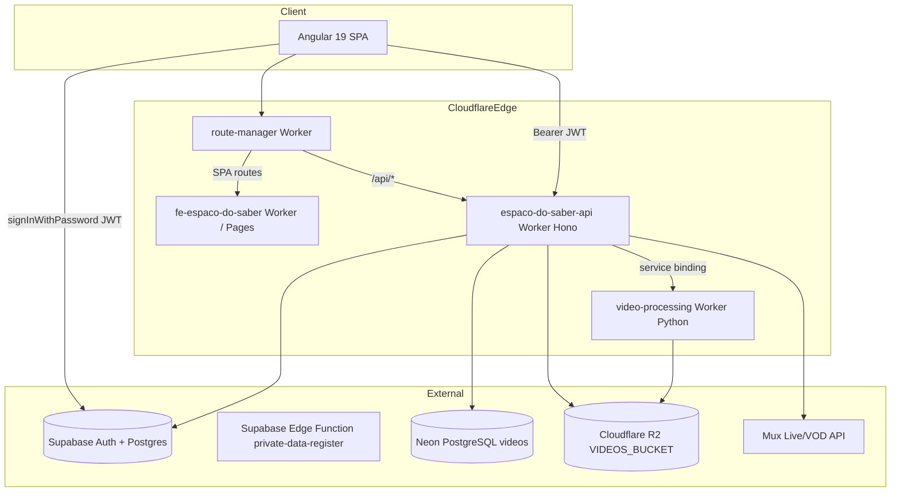

# Architecture Snapshot — Espaço do Saber

> Generated from architectural-analyzer run. Use as shared context for all agents in this workflow.

## System map

## Tech stack

| Layer | Technology |
|-------|------------|
| Frontend | Angular 19, RxJS, `@supabase/supabase-js`, `flv.js`, `hls.js` (installed, unused) |
| API | Cloudflare Workers, Hono 4, `jose`, `@neondatabase/serverless` |
| Video worker | Python Cloudflare Worker (stub) |
| Auth | **Supabase** (JWT, Edge Functions) — README still says Auth0 |
| Video metadata | Neon PostgreSQL |
| User data | Supabase Postgres (`profiles`, `user_roles`) |
| Storage | Cloudflare R2 |
| Streaming | Mux (RTMP ingest, HLS playback) |

## Key paths

| Concern | Path |
|---------|------|
| API monolith | `workers/api/src/index.ts` |
| API config | `workers/api/wrangler.jsonc` |
| Edge router | `workers/route-manager/src/index.ts` |
| Angular routes | `frontend/src/app/app-routing.module.ts` |
| Auth service | `frontend/src/app/shared/services/auth.service.ts` |
| Auth guard | `frontend/src/app/shared/guards/auth.guard.ts` |
| Admin UI | `frontend/src/app/admin/components/admin-dashboard.component.ts` |
| Video upload/playback | `frontend/src/app/shared/services/video.service.ts`, `video-player.component.ts` |
| Mux gateway | `frontend/src/app/shared/services/stream-gateway.service.ts` |
| R2 upload | `frontend/src/app/shared/services/r2-upload.service.ts` |
| Video worker | `workers/video-processing/src/worker.py` |
| Domain rules | `copilot/agents/AdminTeacherPrivilegies.MD` |

## Objectives vs current state

| # | Objective | Status | Critical gaps |
|---|-----------|--------|---------------|
| 1 | Route control / validation (Cloudflare) | Partial | Route-manager checks token **presence only**, not JWT validity; no edge role checks |
| 2 | Login + Supabase | Mostly done | Pending check fails open on API error; dev env placeholders |
| 3 | Admin admit/reject | Mostly done | Depends on Edge Function not in repo; no email notification |
| 4 | Video loading (R2) | Partial | **No auth on `/video-files/:key`**; no signed URLs |
| 5 | MUX streaming | Partial | Wrong playback URL (stream ID vs playbackId); FLV vs HLS mismatch |
| 6 | Security | Needs work | Secrets in wrangler.jsonc; public R2/video reads; debug endpoint |
| 7 | Tests | Not started | 1 broken-ish spec; zero worker tests |

## P0 security findings

1. Secrets committed in `workers/api/wrangler.jsonc` — rotate and use Wrangler secrets
2. `GET /video-files/:key` — unauthenticated R2 streaming
3. `GET /api/videos/:id` — no auth, no `is_public` check
4. Route-manager `isAuthenticated()` — any Bearer string passes
5. `/api/me/debug` — exposes admin user payload

## P1 functional gaps

1. Mux playback: use `playbackId`, switch live player to HLS (`hls.js`)
2. Missing `POST /api/auth/reset-password` (frontend calls it)
3. Remove role default to `aluno` when JWT roles empty
4. Add `/videos/:id` to route-manager PROTECTED_ROUTES

## Test coverage

| Module | Test files |
|--------|------------|
| Frontend | `home.component.spec.ts` only |
| API Worker | None |
| Route manager | None |
| Video processing | None |
